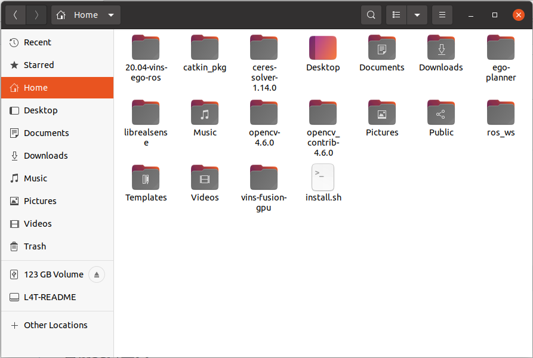
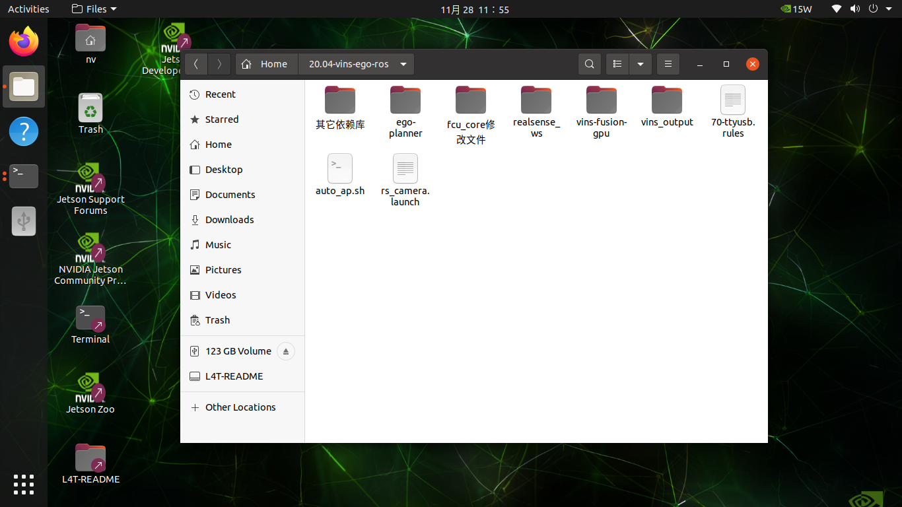

# install.sh 自动化部署脚本

版本：v1.0

## 使用方法（以部署 VINS 为例）

**注意：本部署脚本使用绝对路径查找文件，请勿随意修改下文中使用的文件路径或文件名。**

1. 下载部署工程包并解压到 `/home/nv` 目录下。

2. 将 `install.sh` 复制到 `/home/nv` 目录下。

3. 设置 `install.sh` 的可执行权限：

~~~shell
sudo chmod +x install.sh
~~~

4. 执行脚本：

~~~
./install.sh
~~~

5. 脚本执行过程中会打印每个步骤的执行结果。

成功示例：

~~~shell
Step 1.0 completed successfully
~~~

失败示例：

~~~shell
Step 1.0 failed. Exiting.
~~~

6. 继续执行（断点续跑）

部署过程中可能会出现某些步骤执行失败。修复问题后，可继续执行脚本。可在 `./install.sh` 后添加步骤编号，例如：`./install.sh 6.3`，脚本将从 6.3 步骤继续执行。

7. 脚本说明

脚本本质上是将需要在终端中逐条执行的命令封装并顺序执行。脚本中的每条命令也可以单独在终端运行。若想查看某个步骤具体执行了哪些命令，请打开 `install.sh` 查看。

